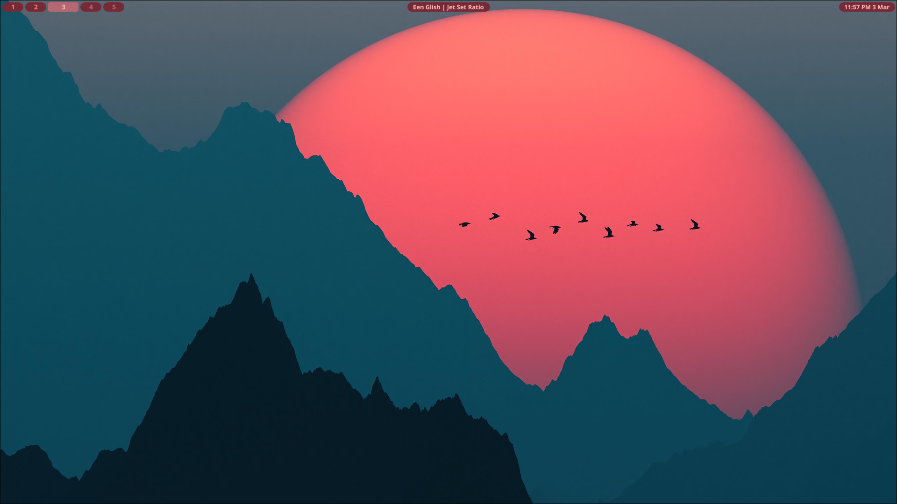
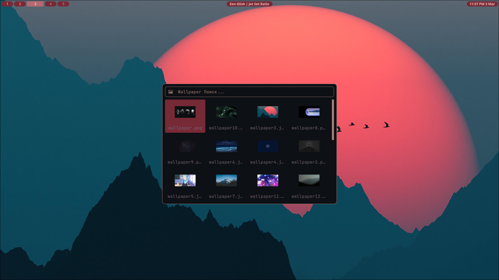
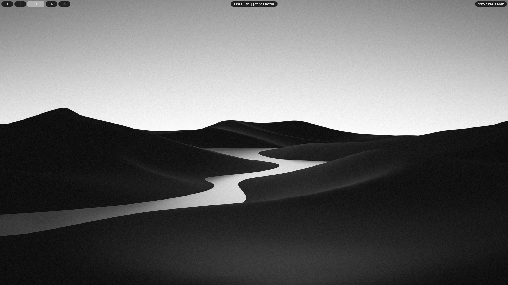

**ATTENTION:** This dots is not finished and is unlikely to be. It just my try to make something with quickshell. You can consider this as mediocre template for your project.

# The simple Hyprland shell
This shell use Quickshell for widgets, rofi for custom menus, wallust for change colors and swww for wallpaper. 

## Preview

